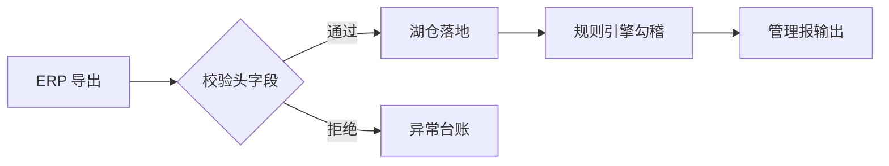

# 2026 年三季度经营分析报告（验收样例）

> 用途：墨读 M1 验收。覆盖：标题层级 / 中英混排 / 金额保护 / 块级与行内公式 / 长表格 / 代码块 / Mermaid / 引用 / 任务列表 / 脚注 / emoji / 长 token 断行。本文件故意混合各种坑位。

## 1 概述

本报告汇总三季度各法人主体的收入、毛利与费用执行情况。本期合并收入 $1,000 万元级别订单共 3 笔，对比上期 $2,000 万元级别订单 5 笔，结构性下移主要来自渠道侧去库存。预算执行率 87.3%，其中销售费用预算¥12,345.67 与实际¥13,890.20 的差异在误差带内。

系统侧的批次号 `transform_request_id_20260921` 已完成全链路对账，关联的对冲台账编号为 `FX_HEDGE_POSITION_Q3_2026`，Stripe 测试密钥样例 `sk-live-9f8e7d6c5b4a3210` 出现在日志脱敏检查项中——这些长标识符在正文中应当自然断行填充，而不是把上一行的汉字间距撑开。

## 2 关键指标

| 指标 | 本期 | 上期 | 环比 | 预算 | 达成率 | 备注 |
|---|---:|---:|---:|---:|---:|---|
| 合并收入（万元） | 18,204 | 21,860 | -16.7% | 20,000 | 91.0% | 渠道去库存影响 |
| 综合毛利率 | 31.2% | 29.8% | +1.4pp | 30.0% | 104.0% | 产品结构改善 |
| 销售费用（元） | 13,890.20 | 12,401.55 | +12.0% | 12,345.67 | 112.5% | 展会集中投放 |
| 研发费用化（万元） | 4,102 | 3,988 | +2.9% | 4,200 | 97.7% | 人员稳定 |
| 经营现金流（万元） | 2,450 | 1,102 | +122.3% | 2,000 | 122.5% | 回款改善 |

> 注：上表 6 列、含右对齐数字，用于验证宽表格在 46em 栏宽下的横向滚动与表头样式。

## 3 定价模型

终值折现采用复利公式（块级，应完整显示、无横向滚动条）：

$$FV = P \times \left(1 + \frac{r}{n}\right)^{nt}$$

其中行内变量 \(P\) 为本金、\(r\) 为年化名义利率、\(n\) 为复利次数、\(t\) 为期数。当 \(n \to \infty\) 时退化为连续复利 \(FV = Pe^{rt}\)。风险敞口的敏感度系数 \(\Delta = \frac{\partial V}{\partial S}\) 在 Delta 中性策略下应趋近于零。

## 4 数据管道变更

三季度的取数管道从旧仓库迁到了新湖仓，核心变更如下：

```typescript
interface ReconResult {
  batchId: string;
  rowsTotal: number;
  rowsMatched: number;
  diffTolerance: number; // 容差 5e-7，golden-diff 契约
}

function reconcile(batch: ReconResult): boolean {
  const ratio = batch.rowsMatched / batch.rowsTotal;
  return ratio === 1 || Math.abs(1 - ratio) < batch.diffTolerance;
}
```

```sql
SELECT legal_entity, SUM(amount_lc) AS amount_lc, COUNT(*) AS cnt
FROM gl_balance
WHERE period = '2026Q3' AND subject_code LIKE '6001%'
GROUP BY legal_entity
ORDER BY amount_lc DESC;
```

```
这段代码块没有语言标注——按性能红线约定应纯转义、不做自动语言猜测高亮。
```

## 5 流程与排期

对账流程调整为三段式：



- [x] ERP 侧接口联调
- [x] 湖仓表结构评审
- [ ] 规则引擎 42 条规则迁移 :warning:
- [ ] 管理报模板定稿

## 6 风险与结论

:dart: 结论：三季度收入下移但毛利率改善，费用差异可控。:chart_with_upwards_trend: 现金流为最亮点。

风险提示见脚注[^1]，敏感科目口径差异见脚注[^2]。

[^1]: 渠道库存去化进度低于预期时，Q4 收入确认节奏存在后移风险。
[^2]: 研发费用化口径自 2026Q2 起包含委托开发，同比不可直接比较。

---

*本样例由墨读 M1 验收流程生成：重点看金额 `$1,000` 未被公式吞、公式完整无滚动条、长 token 段字距正常、表格可横滚、mermaid 出图。*
